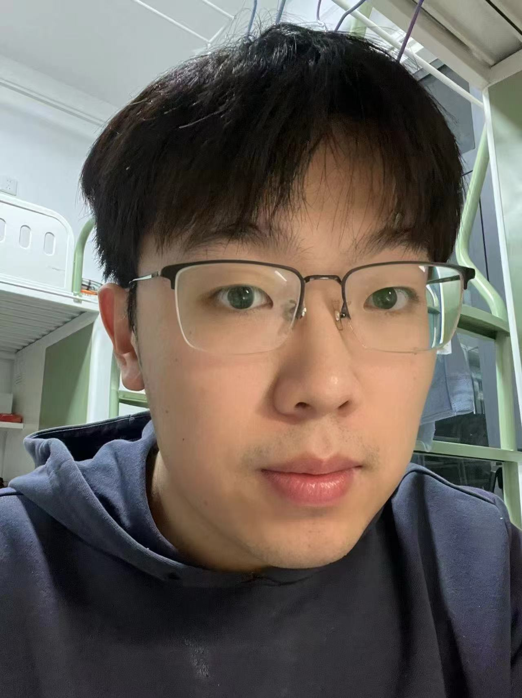

{: width="140" style="border-radius:50%;display:block;margin:0 auto" }

<strong>刘俊康</strong> 
天津大学 · 计算机科学与技术 · 博士生 
<a href="mailto:junkangliukk@gmail.com">📧 junkangliukk@gmail.com</a> | 
<a href="https://scholar.google.com/citations?user=你的ID">谷歌学术</a> | 
<a href="https://github.com/你的GitHub">GitHub</a>

---

## 🔥 最新动态
- 2025.09 即将入学 **天津大学** 攻读博士学位  
- 2024.12 论文《FedAdamW》被 **AAAI 2025** 接收（一作）  
- 2024.10 荣获 **研究生国家奖学金**  

## 🎯 研究方向
- 联邦学习（通信高效、差分隐私、个性化）  
- 大模型高效微调（LoRA / Adapter / Prompt Tuning）  
- 优化理论（非凸、重尾分布、锐度感知最小化）

## 📝 代表性论文
（*为一作或学生一作）

1. *FedBCGD：面向联邦学习的通信高效加速块坐标梯度下降*  
   ACM Multimedia 2024（CCF A） [PDF] [代码]

2. *基于动量随机控制加权平均的联邦学习泛化增强方法*  
   ICML 2025（CCF A） [PDF]

3. *结合 Nesterov 外推的锐度感知最小化广义联邦学习框架*  
   ACM Multimedia 2025（CCF A） [PDF]

4. *基于 DySAT 模型的时序动态技术融合预测：以中国 5G 通信为例*  
   《情报科学》2023（IF=4.18，学生一作） [PDF]

> 在投/再审：TIFS×2、TPAMI、NeurIPS、AAAI、TKDE 等 CCF A 类论文 5 篇。

## 🏆 获奖荣誉
- 2024 研究生国家奖学金（Top 2%）  
- 2020 本科生国家奖学金（Top 2%）  
- 2023 西安电子科技大学优秀研究生  
- 2022 美国大学生数学建模竞赛 M 奖（一等奖）  
- 2021 中国大学生数学建模竞赛全国二等奖  
- 2020 全国大学生数学竞赛全国二等奖  

## 🎓 教育背景
- **博士（预计）** 计算机科学与技术 天津大学 2025 – 今  
- **硕士** 计算机科学与技术 西安电子科技大学 2022 – 2025  
- **学士** 数学与应用数学 青岛大学 2018 – 2022  

## 📌 科研项目
国家自然科学基金面上项目  
《大规模机器学习动量加速方法的理论研究与应用》  
参与人 2022.09 – 2024.12  
- 设计 FedBCGD 算法，通信开销降低 3×  
- 给出非凸目标下的收敛率与泛化界
---
layout: home
title: "Jun-Kang Liu | 刘俊康"
---

{: width="140" style="border-radius:50%;display:block;margin:0 auto" }

<strong>Jun-Kang Liu (刘俊康)</strong> 
Ph.D. Student, Computer Science, Tianjin University 
<a href="mailto:junkangliukk@gmail.com">✉ junkangliukk@gmail.com</a> |
<a href="https://scholar.google.com/citations?user=YOUR_ID">Scholar</a> |
<a href="https://github.com/YOUR_GITHUB">GitHub</a>

---

## 🔥 News
- **Jun 2025** Starting Ph.D. at **Tianjin University**  
- **Dec 2024** 1 paper accepted by **AAAI 2025** (first author)  
- **Oct 2024** Awarded **National Scholarship for Graduate Students**  

## 🎯 Research Interests
- **Federated Learning**: communication efficiency, differential privacy, personalization  
- **Efficient Fine-Tuning**: LoRA, adapters, prompt tuning for LLM / LVM  
- **Optimization Theory**: non-convex, heavy-tailed, sharpness-aware minimization  

## 📝 Selected Publications  
*First author unless noted.*

1. **FedBCGD**: Communication-Efficient Accelerated Block Coordinate Gradient Descent for Federated Learning  
 *ACM Multimedia 2024* (CCF A) [PDF] [Code]

2. **Improving Generalization in FL with Heterogeneous Data via Momentum-Based Stochastic Controlled Weight Averaging**  
 *ICML 2025* (CCF A) [PDF]

3. **Generalized Federated Learning via Sharpness-Aware Minimization with Nesterov Extrapolation**  
 *ACM Multimedia 2025* (CCF A) [PDF]

4. **Temporal Dynamic Technology Convergence Prediction Based on DySAT Model**  
 *Information Science* (IF=4.18, student first author) [PDF]

*Under review: 2×TIFS, 1×TPAMI, 1×NeurIPS, 1×AAAI, 1×TKDE (all CCF A).*

## 🎖 Honors & Awards
- **2024**  National Scholarship (Graduate)  
- **2020**  National Scholarship (Undergraduate)  
- **2023**  Outstanding Graduate Student, Xidian University  
- **2022**  M Prize, MCM/ICM  
- **2021**  2nd Prize, China Undergraduate Mathematical Contest in Modeling  

## 📖 Education
- **Ph.D. in Computer Science**, Tianjin University, 2025 –  
- **M.S. in Computer Science**, Xidian University, 2022 – 2025  
- **B.S. in Mathematics & Applied Mathematics**, Qingdao University, 2018 – 2022
